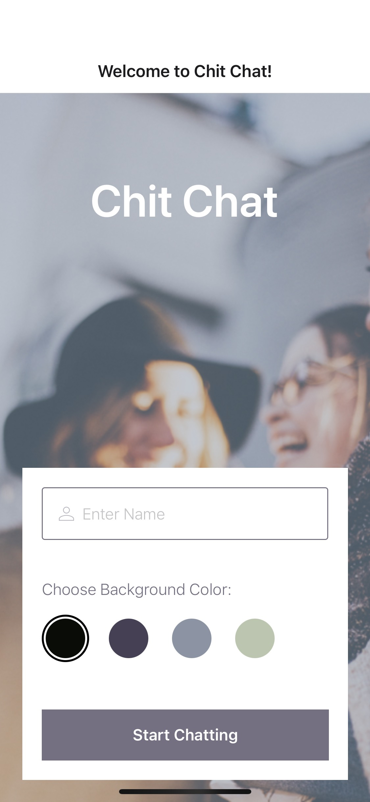

# Chit Chat

Chit Chat is a chat application for mobile devices. It was developed using React Native to provide users with a chat interface and options to share images and their location.

## User Stories

* As a new user, I want to be able to easily enter a chat room so I can quickly start talking to my friends and family.
* As a user, I want to be able to send messages to my friends and family members to exchange the latest news.
* As a user, I want to send images to my friends to show them what I’m currently doing.
* As a user, I want to share my location with my friends to show them where I am.
* As a user, I want to be able to read my messages offline so I can reread conversations at any time.
* As a user with a visual impairment, I want to use a chat app that is compatible with a screen reader so that I can engage with a chat interface.

## Key Features

* Users can enter their name and choose a background color for the chat screen before joining the chat.
* Separate page displaying conversations
* Users will have two additional communication features: sending images and location data.
* Data gets stored online and offline.

## Tech Stack

* React Native
* Expo
* Google Firebase
* 

## Installation

### Prerequistes

NPM or Yarn

* NPM: `npm install expo-cli --global`
* Yarn: `yarn global add expo-cli`

### Dependencies

* While in the root folder of the project
* Run `npm install` or `yarn install`

### Run the Application

* To launch the application, run `expo start` or `npm start`

Use one of the following to view the application

* Installed Android emulator
* iOS simulator
* QR code with mobile device

### Firebase

* Visit [Google Firebase](https://firebase.google.com/) and create an account.
* Use the **Go to console** link in the upper right corner, then click on **Create Project**.
* Name your new project and leave the settings at default.
* After the project has been created and from the Firebase dashboard, create a database.
  * From the Firebase dashboard, open the **Build** submenu from the left-hand side and select **Firestore Database**.
  * Select **Create Database**.
* Open the project settings by selecting the gear icon next to **Project Overview** then selecting **Project Settings**.
* Under the **General** tab, you’ll find a section called **Your apps**.
* Click the **Firestore for Web** button (it may be shown as the **</>** icon).
* Register the web application to generate configuration code.
* Copy **firebaseConfig** object and paste it into the credentials location in **Chat.js**